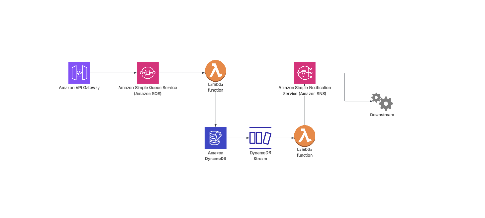
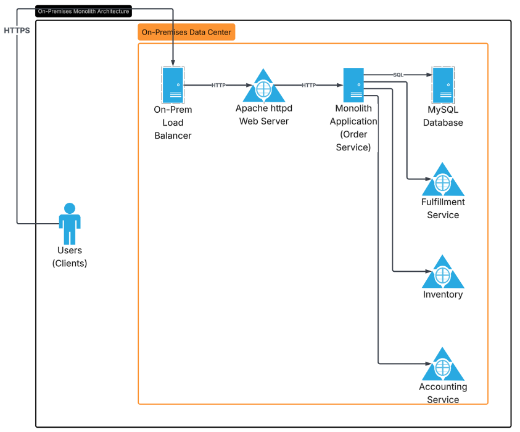

# Designing a Scalable Serverless Event-Driven Architecture on AWS for an E-Commerce Platform
AWS serverless event-driven architecture for scalable e-commerce order processing using API Gateway, Lambda, SQS, DynamoDB, SNS, and CloudWatch.

## Client Business Overview:
The client has an E-Commerce business. They sell their products all over the world through their website. They have a dedicated “order service” that collects all the orders from across various frontends. The “order service” is hosted on-premises, which validates, authenticates, accepts, processes, and stores orders in the database (MySQL), which consists of one big table. The order service then triggers the other downstream services, like inventory, fulfilment, and accounting.

## Issues Facing:
* Business logic is all tied together in one “Order Service”.
* When overloaded, the “Order Service” slows down and sometimes crashes.
* Orders fail when the application is overwhelmed.
* Facing a hard time scaling the system fast enough on premises.
* When the system is down, the “Order Service” does not get the chance to send the information to downstream services for successful orders.
* When an API call fails, it creates an inconsistency in the order data.
* Facing a big challenge when there are traffic spikes due to sales, coupons, and promotions. 

## Requirements:
* Host web backend infrastructure on AWS to accept and process orders.
* Use a database in AWS that is highly available, durable, and easier to manage than the current MySQL on-premises.
* Implement automatic scaling to handle spiky demand, scaling up during high traffic and scaling down when demand is low.
* Decouple components so that downstream calls (e.g., inventory, accounting) are independent and don’t affect order processing.
* Ensure monitoring and logging are easy to set up and use a unified logging system.
* Optimise for cost and performance to make the solution efficient and affordable.
* Prefer a serverless or managed approach to reduce operational overhead.

## Current Architecture:
Carefully analysing the business logic and description, we can visualise the current architecture of the existing system as shown in the following:

## Proposed Solution:

To address the requirements provided, I designed a serverless, event-driven architecture. The summary goes as follows:

* **Amazon API Gateway:** Will act as a front door, receiving all requests/traffic from the frontend (mobile app, desktop, etc.). It authenticates incoming requests and validates their format before passing them on. 
* **Amazon SQS (Simple Queue Service):** Serves as a message queue that holds incoming order requests temporarily. This decouples the API from the processing logic, allowing smooth handling of traffic spikes.
* **AWS Lambda:** Runs the application code to process orders. One Lambda function reads messages from the SQS queue, processes the orders, and stores them in DynamoDB. Another Lambda function processes DynamoDB streams to send order updates downstream.
* **Amazon DynamoDB:** A fast, scalable NoSQL database that stores order data.
* **DynamoDB Streams:** Captures changes in the DynamoDB table (like new orders) and triggers the second Lambda function to handle downstream notifications.
* **Amazon SNS (Simple Notification Service):** Publishes order information to multiple subscribed services (fulfilment, accounting, inventory) using a fan-out pattern.
* **Amazon CloudWatch logs:** Collects monitoring data and logs from all services to help track performance and troubleshoot issues.

## AWS Services Used
* IAM
* Lambda
* CloudWatch Logs
* API Gateway
* DynamoDB
* DynamoDB Streams
* SQS
* SNS

## Security Considerations
Security best practices were integrated throughout the architecture design:
* IAM least-privilege access policies
* Controlled API access
* Secure service-to-service permissions
* Centralised monitoring and logging
* Managed infrastructure, reducing attack surface

## Business Outcome Matrix:
* Reduced operational overhead
* Improved scalability
* Minimised failure propagation
* Improved resilience
* Lower infrastructure management burden

## Cost Optimisation:
* Pay-per-use Lambda
* Serverless scaling
* Reduced infrastructure maintenance
* No server management
* DynamoDB on-demand scaling

## Final Thoughts
This project demonstrated how modern AWS serverless architectures can improve scalability, reliability, operational efficiency, and fault tolerance for high-traffic business applications.
Building this solution also helped deepen my understanding of cloud-native design patterns, distributed systems, and AWS architecture best practices.
